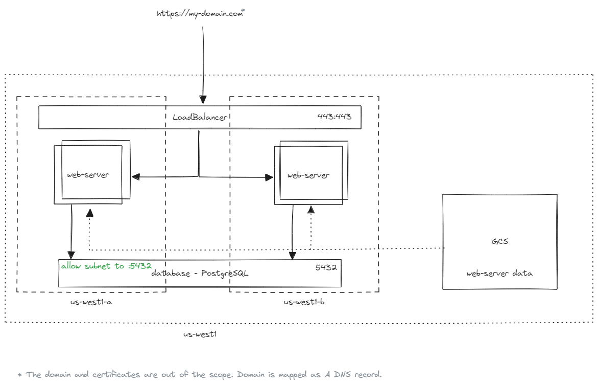

= Second assessment
ifdef::env-github[]
:tip-caption: :bulb:
:note-caption: :information_source:
:important-caption: :heavy_exclamation_mark:
:caution-caption: :fire:
:warning-caption: :warning:
endif::[]
ifndef::env-github[]
:imagesdir: ./
endif::[]
:toc:
:toc-placement!:

== Overview

.GCP Infrastructure:
* Web application based on a web server (e.g. Nginx, Apache)
* Database (e.g. MySQL, PostgreSQL)
* Web-based storage (e.g., S3, GCS)
* Application should be scalable and kept in High Availability approach

== Solution architecture

== Limitations

Following project has not been finished. The infrastructure is automated but the GCS and database are not connected with the instances.

There are several security issues, like the instances have public ips, or there is no IAM set on the bucket or DB level.
